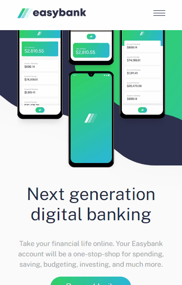
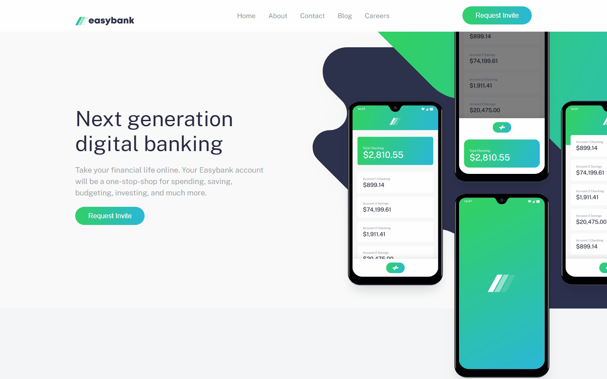

<h1 align="center" style="font-weight:600;">Easybank landing page </h1>
 
 

  

## Overview

A fictional bank landing page, built from the [Frontend Mentor](https://www.frontendmentor.io/) Challenge series.

## Project Showcase

Built a React page to showcase the following:

- My ability to build a client UI based on a designer's mockup.
- My ability to use React and NextJS React framework.
- The results of jumping back into using Sass and SCSS but this time within NextJS.

### Technologies Used

- React
- NextJS
- SCSS
- Git
- GitHub

## Visuals

  

  

